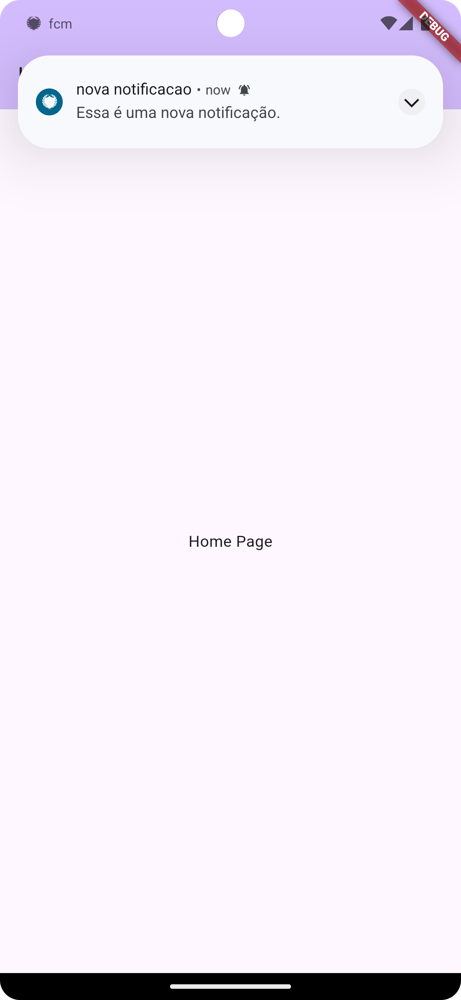

# My Flutter Firebase Messaging App

Este é um aplicativo simples construído com Flutter para demonstrar o uso do Firebase Cloud Messaging (FCM) para receber notificações push.

## Funcionalidades

- **Página Principal (`MyHomePage`)**: Uma página inicial básica com um título e texto estático.
- **Página Segunda (`SecondPage`)**: Uma página secundária que exibe dados de notificação push quando acionada.
- **Configuração do Firebase**: Inicializa o Firebase e subscreve-se ao tópico de notificações.

## Screenshot

## Pré-requisitos

- Flutter SDK instalado e configurado.
- Conta do Firebase com um projeto criado.

## Como executar o projeto
1. Clone este repositório em sua máquina local.
2. Certifique-se de ter configurado corretamente o Firebase em seu projeto.
- Pode encontrar instruções para configuração nesse site: https://firebase.flutter.dev/docs/overview/
3. Abra o projeto no Visual Studio Code ou em qualquer outro editor de código de sua preferência.
4. Execute o projeto usando o comando flutter run.

## Estrutura do Projeto
- main.dart: Arquivo principal do aplicativo que contém a função main() e a definição da classe MyApp.
- home_page.dart: Contém a classe MyHomePage que define a página inicial do aplicativo.
- second_page.dart: Contém a classe SecondPage que define a página secundária do aplicativo.
- controller.dart: Controlador para a inicialização do Firebase e a inscrição no tópico de notificações.
